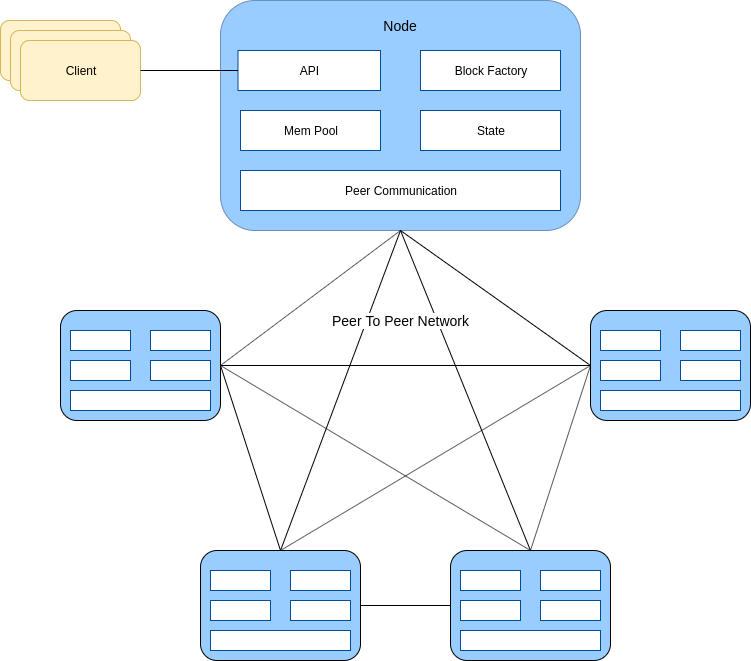

# MPoC Implementation 

Out expriment setup for MPoC Paper.

## Node Architecture



In our setup, blockchain network is built based on peer-to-peer archi-
tecture. Inside each node, there are five deployed services, covering: API, Block
Factory, Mem Pool, State, and Peer Communication. The API service has the
functions to communicate with the clients, validate data, create transactions
and forward them to Mem Pool. Mem Pool is a memory space that enables to
store transactions before they are packed into valid blocks. A selected node uses
its Block Factory service to gather transactions stored inside Mem Pool, and
then produces a new block. Block Factory also orders State service to update
its information (i.e. criteria data of nodes). Peer Communication has two main
tasks: broadcasting and receiving blocks. Thus, after being produced, Peer Com-
munication immediately broadcasts the newly created block to other nodes. In
the case of Peer Communication receives blocks from others. It forwards the
blocks to Block Factory to check the validity. If those blocks are valid, Peer
Communication will broadcast the block to others.

## Run cluster

- First, generate docker-compose files, each file contains 50 node(service), will generate n files:

```
python gen.py <number_of_nodes>
```

- Then, generate genesis block:

```
python cluster.py <number_of_nodes> <number_of_leaders>
```

- Finally, start nodes:

```
docker-compose -f docker-compose-<i>.yml up
```

i range from 0 to n-1.